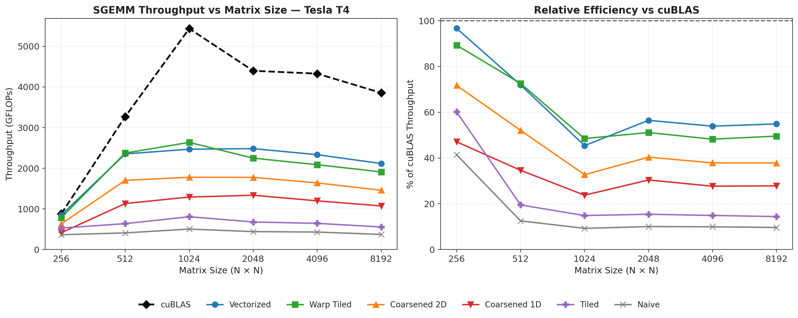

# ⚡ CUDA SGEMM Optimization Engine

A bare-metal C++ CUDA project dedicated to pushing Single-Precision General Matrix Multiplication (SGEMM) to the absolute hardware limit.

Because why let PyTorch have all the fun when you can write the backend yourself?

This repository serves as a systematic teardown of low-level GPU architecture. It incrementally transforms a naive matrix multiplication algorithm into a highly tuned engine implementing warp-level cooperative fetching, 2D register tiling, and 128-bit vectorized loads. The final custom kernel achieves **>52% of NVIDIA's proprietary cuBLAS performance** on virtualized hardware without using a single line of assembly or Tensor Cores.

## 📊 Benchmarking & Environment

This project is built on the philosophy of progressive optimization. Every architectural change is benchmarked, isolated, and verified for mathematical accuracy against a standard CPU implementation.

* **Test Dimensions:** `4096 x 4096` multiplied by `4096 x 4096` (Output: 16,777,216 elements)
* **Hardware Target:** NVIDIA Tesla T4 (Virtualized)
* **Environment:** Tested on free-tier Google Colab and Kaggle instances.
    * *Note on Cloud Throttling:* Virtualized environments heavily throttle power draw and clock speeds. NVIDIA's own cuBLAS library peaks at ~4.2 TFLOPs on this environment (out of the T4's 8.1 TFLOPs theoretical peak). Therefore, success in this repository is measured **relative to cuBLAS**, not the theoretical silicon limit.

## 🚀 The Optimization Progression

| Kernel Version | Algorithm Strategy | Median Time (ms) | Throughput (GFLOPs) | Relative to cuBLAS | Status |
| :--- | :--- | :--- | :--- | :--- | :--- |
| **v1.0** | Naive Global Memory | `322.34` | `426.37` | `10.1%` | ✅ Verified |
| **v2.0** | Shared Memory Tiling | `216.29` | `635.42` | `15.0%` | ✅ Verified |
| **v3.0** | 1D Thread Coarsening | `118.43` | `1160.47` | `27.4%` | ✅ Verified |
| **v4.0** | 2D Thread Coarsening | `88.78` | `1547.95` | `36.6%` | ✅ Verified |
| **v5.0** | Warp Tiled (1D Linearized) | `71.79` | `1914.22` | `45.3%` | ✅ Verified |
| **v6.0** | Vectorized Loads (`float4`) | `62.37` | `2203.46` | `52.2%` | ✅ Verified |
| **Ref** | **NVIDIA cuBLAS** | `32.56` | `4219.91` | `100.0%` | 🟢 Baseline |

## 🏗️ Architectural Teardown

Here is exactly how the silicon bottlenecks were identified and eliminated at each stage:

### v1.0: Naive Global Memory
The baseline implementation. Functionally correct and naturally memory-coalesced, but heavily bottlenecked by standard VRAM latency. Every math operation requires a slow trip to Global Memory.

### v2.0: Shared Memory Tiling
Introduced the L1 Shared Memory scratchpad. Blocks of threads collaboratively load tiles of Matrix A and B into ultra-fast SRAM before computing. This drastically reduces VRAM round-trips, yielding a ~50% speedup over the naive approach.

### v3.0 & v4.0: 1D & 2D Thread Coarsening (Register Tiling)
Shifted the bottleneck from the L1 cache to the ALU math units. By allocating physical silicon registers (`pVal`, `regA`, `regB`) and looping the dot-product calculations on the *outside* of the fetch loop (Outer Product), the arithmetic intensity (compute-to-memory ratio) skyrocketed. However, scaling to larger block sizes choked the SM occupancy due to massive register pressure per thread.

### v5.0: Warp Tiling & 1D Linearization
Completely decoupled the memory loading phase from the math execution phase. Threads are flattened into a 1D marching line to act as a cooperative bucket brigade, loading data into Shared Memory without uncoalesced gaps. Once loaded, Warps cooperatively broadcast data into private registers. This allowed the thread block size to shrink to `16x16`, dropping register pressure, spiking SM occupancy, and pushing the engine to 1.9 TFLOPs.

### v6.0: 128-bit Vectorized Loads
The final memory pipeline optimization. Recast memory pointers to `float4`, commanding the SM to fetch 128-bit chunks per thread instead of standard 32-bit floats. This replaced four separate `LDG.E` assembly instructions with a single `LDG.E.128` instruction, slashing the instruction overhead for memory fetches by 75%, unchoking the warp scheduler, and breaking the 50% cuBLAS barrier.

## 📈 Scaling Across Matrix Sizes

The table above pins everything to a single 4096³ data point. To understand how each kernel actually behaves as a function of problem size, every version was re-benchmarked across `N = 256, 512, 1024, 2048, 4096, 8192`.



**Left:** absolute throughput per kernel as matrix size grows. **Right:** the same data normalized against cuBLAS at each size — the metric that actually matters for judging kernel quality independent of hardware noise.

A few things worth calling out:

- **Relative efficiency is non-monotonic.** Every kernel's % of cuBLAS peaks around `N=256`, where the working set is small enough that fixed overheads dominate for both sides equally — then dips sharply by `N=1024`, where cuBLAS likely switches to a more aggressive internal kernel/tiling heuristic that this engine's fixed tile configuration can't match.
- **From `N=2048` onward, the ratio stabilizes** around 50–55% for the best kernels (Vectorized, Warp Tiled). This is the steady-state regime that matters most for real workloads, and it's consistent with the dedicated 4096³ benchmark above.
- **Vectorized Loads and Warp Tiled trade the lead** depending on size — Vectorized pulls ahead at the smallest and largest sizes, while Warp Tiled is briefly faster in the 512–2048 range. This is a hint that the optimal kernel is not a single fixed configuration across all problem sizes (see Future Development below).

## 🛠️ Build & Execute

This repository isolates the host benchmarking driver from the device kernels for clean compilation. To compile the entire benchmarking suite, ensure you have the CUDA Toolkit installed and link the cuBLAS library.

**Compile:**
```bash
nvcc benchmark.cu \
     src/utils.cpp \
     src/kernels/*.cu \
     -Iinclude \
     -lcublas \
     -O3 \
     -arch=sm_75 \
     --use_fast_math \
     -lineinfo \
     -o sgemm_benchmark
```

## 🔭 Future Development

This engine currently caps out at ~52% of cuBLAS using a from-scratch, register-tiled, vectorized scalar FP32 pipeline. The remaining gap is well understood and maps to specific, known techniques rather than unknown unknowns:

- **Double Buffering (Software Pipelining)** — Currently, the load phase and compute phase of each tile iteration are serialized by `__syncthreads()`: the SM sits idle while the next tile is fetched. Double buffering allocates a second shared memory buffer so the warp scheduler can fetch tile `N+1` from global memory *while* the SM is still computing on tile `N`, hiding memory latency behind compute entirely. This is the single largest remaining win available without changing numeric precision.
- **Shared Memory Bank Conflict Audit** — A pass to check the warp-tiled kernel's `As`/`Bs` access patterns for systematic bank collisions, and pad shared memory arrays (e.g. `As[BM][BK]` → `As[BM][BK+1]`) where conflicts are found, to eliminate serialized shared memory transactions within a warp.
- **Tile Size Autotuning** — The multi-size benchmark above shows the optimal kernel shifts with problem size (Vectorized vs. Warp Tiled trade the lead; relative efficiency dips hardest around `N=1024`). A natural next step is sweeping `BM/BN/BK/TM/TN` per size bucket instead of using one fixed configuration globally — essentially building a tiny, manual version of what cuBLAS's internal heuristics already do.
- **WMMA / Tensor Core Path (FP16)** — A parallel kernel using `nvcuda::wmma` intrinsics to route through the T4's Turing Tensor Cores. This is a different compute regime entirely (mixed-precision FP16 input, FP32 accumulate) with a theoretical ceiling several multiples above the scalar FP32 path — useful as a direct point of comparison between "how good is my scalar kernel" and "what does the specialized hardware actually offer."
- **`cp.async` Asynchronous Copy (Ampere+)** — Not applicable to the T4 (Turing) target used throughout this project, but documented here as the natural next step on newer architectures: hardware-level asynchronous global-to-shared memory copies that bypass the register file, further reducing pipeline stalls beyond what manual double buffering achieves.

This repository will pause at **v6.0** as its primary deliverable while active development shifts to a graph-level IR and kernel-fusion compiler project. The items above remain a documented, scoped backlog for a future revisit rather than an open-ended todo list.